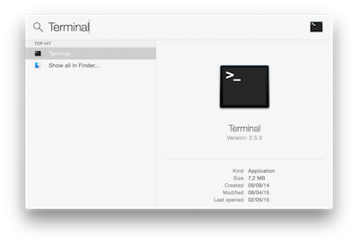

## Command Line Tools

> Command line tools is a package of tools for MacOS that are needed for us, because some technologies that we'll install today depends on it

To install command line tools, your first need to open the Terminal (click the magnifying glass icon in the top right corner of your screen and type `Terminal`):



Copy-paste the following command in the terminal and hit Enter.

```bash
xcode-select --install
```

If you'll receive the following message, you can just skip this step and go to next step.

```
# command line tools are already installed, use "Software Update" to install updates
```

Otherwise, it will open a window asking you if you want to install some software. Accept and wait. If it fails, try again the command line above, sometimes the Apple servers are overloaded.


